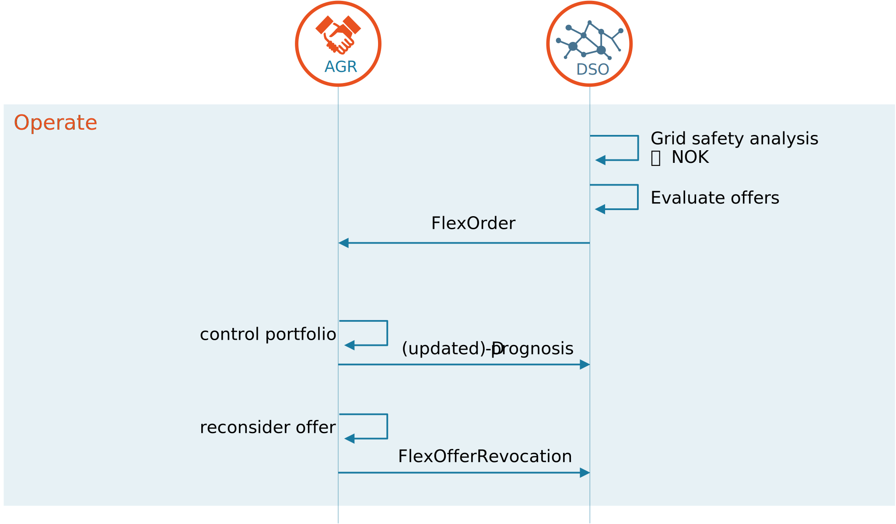

# Operate phase

While (similar to the current liberalized energy market) the total energy system will remain in balance, without any congestion issues, as long as there are no deviations from the plans, it is unlikely that all plans will be executed exactly.
Deviations can arise from a range of sources, ranging from changing weather expectations to an extension of a football match.
Deviations can lead to: imbalances in supply and demand of energy at total system level (affecting the BRP); changes within the AGR portfolio (affecting the AGR); and local congestion in the distribution system (affecting the DSO).
USEF’s MCM is designed such that, during the operate phase, additional flexibility can be applied in order to compensate for these deviations.
The processes for invoking this flexibility are depicted in Figure 2-11.

<!-- TODO: check why this image has been shortened in the .pdf file -->

<figure markdown>
  
  <figcaption>General information flows in the Operate phase.</figcaption>
</figure>

During the operate phase, the AGR’s main goal is to adhere to its plan and respect the D-prognoses.12
In order to achieve this, FlexOfferRevocation the AGR must first plan to ensure assets operate in accordance with its forecast portfolio performance and that any flexibility sold is actually delivered.

Next, the AGR measures the net demand or supply of its portfolio, in order to detect deviations from its plan and D-prognoses.
Where deviations occur, the AGR re-optimizes its portfolio.
It is possible that deviations could be solved using the flexibility contained within the portfolio itself.

If this is not the case, the AGR must change its plan (and probably limit its liabilities due to non-performance, to minimize fines) and control the assets to ensure that the new plans are realized and send an updated D-prognosis.
If a FlexOffer has already been ordered, but the AGR is not able to comply, the AGR should inform the DSO as soon as possible through direct means outside of the UFTP protocol.
During the operate phase, the AGR may wish to revoke outstanding (i.e. not ordered) FlexOffers if it is no longer able or willing to deliver the flexibility.

Although the DSO will reduce congestion risks in the validate phase, the DSO can still request that AGRs dispatch flexible power options to resolve potential grid problems in the operate phase.
Again, due to time constraints, this will be done based on flexibility offers from the validate phase, which are still valid.
When this flexibility is used, the corresponding BRP portfolio will no longer be in balance.
Where the AGR is responsible for the balance, it will most likely charge the additional costs to the DSO.
This is not considered further.
