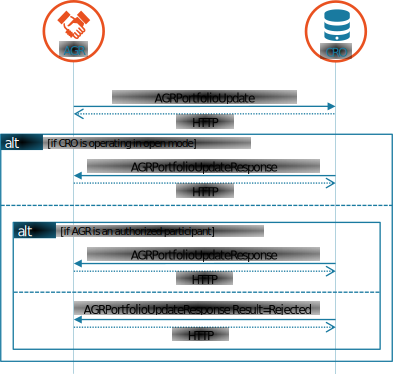

# Contract phase

In section 2.2 the informative description of the contract phase processes has been given.
In this chapter use cases will be described as derived from the contract phase.

The USEF MCM contract phase specifies the following use cases:

_Use cases for the Contract phase._

| Name                                  | Direction | Message types                                   |
|---------------------------------------|-----------|-------------------------------------------------|
| Publish Congestion Points (Long-term) | DSO → CRO | DSOPortfolioUpdate / DSOPortfolioUpdateResponse |
| Publish Connections                   | AGR → CRO | AGRPortfolioUpdate / AGRPortfolioUpdateResponse |

## Publish Congestion Points (Long-term)

Once a flexibility market is functional for an area, the DSO has to update and publish a register of possible congestion points, including the connection identifiers of connected prosumers.
This register is maintained by the Common Reference Operator.
If operating in open mode, the CRO will accept updates from any USEF-compliant participants implementing the DSO role.
In closed mode, participants will need to be pre-configured in order for updates to be accepted.

Once populated, the common reference will allow AGRs to determine whether there are prosumers in their portfolio that can offer flexibility, via their connections, to one or more congestion points.

<figure markdown>
  
  <figcaption>Exchange of congestion points including connections by DSO</figcaption>
</figure>

<table>
  <tr>
    <th></th>
    <th colspan="2">Publish Congestion Points / DSO Portfolio</th>
  </tr>
  <tr>
    <th>Goal in context</th>
    <td colspan="2">In order to predict congestion and create a flex market: publish Congestion Points – including their associated Connections – to the Common Reference, so they become available to the AGRs.</td>
  </tr>
  <tr>
    <th>Preconditions</th>
    <td colspan="2">Common Reference is available to DSO and AGRs</td>
  </tr>
  <tr>
    <th>Successful outcome</th>
    <td colspan="2">The Common Reference is updated with the latest Congestion points and associated Connections (i.e. all connected Prosumers)</td>
  </tr>
  <tr>
    <th rowspan="6">Failure outcome</th>
    <th>RejectionReason</th>
    <th>Cause of rejection</th>
  </tr>
  <tr>
    <td>&lt;See action 3.5&gt;</td>
    <td>DSOPortfolioUpdate failed to pass validation by the CRO</td>
  </tr>
  <tr>
    <td>Unauthorized</td>
    <td>CRO is operating in closed mode and the DSO is not pre-registered as an authorized participant</td>
  </tr>
  <tr>
    <td>Connection conflict: [&lt;Connection EntityAdress&gt;] at [&lt;CongestionPoint EntityAddress&gt;]</td>
    <td>A connection is transmitted before at another Congestion Point. Return EntityAddress of the concerning Connection and Congestion Point where it has been placed before.</td>
  </tr>
  <tr>
    <td>Subordinate sequence number</td>
    <td>The message sequence is lower than that of a previously received DSOPortfolioUpdate</td>
  </tr>
  <tr>
    <td>[User defined]</td>
    <td>Any other reasonable cause to reject the message</td>
  </tr>
</table>

### Related information

It is the responsibility of the CRO to have policies regarding access, data retention, data security and conflict resolution compliant with the USEF privacy & security guidelines.
If the CRO detects strange behavior in the periods (e.g.an EndPeriod in the far past, an EndPeriod earlier than the StartPeriod or an EndPeriod of a congestion point earlier than the EndPeriod of a connection that it contains), it is up to the CRO to decide whether to reject the message, adjust the period or reply with a warning.

A DSO can update its portfolio by retransmitting the DSOPortfolioUpdate.
It is essential to use a sequence number that is incremented each time a new revision is sent so the order of transmission can be traced.
To remove a congestion point, the DSO can transmit a new DSOPortfolioUpdate where the EndPeriod is the current time.
The congestion point is then immediately expired.
It is not necessary to add connections to this message since they will also expire.

## Publish Connections

Once a flexibility market is functional for an area, the AGR has to publish a list of the connection identifiers of the prosumers it has contracted.
This list is stored and, subject to access controls, made available to other market participants by the CRO.

<figure markdown>
  
  <figcaption>Exchange of connections by AGR</figcaption>
</figure>

<table>
  <tr>
    <th></th>
    <th colspan="2">Publish Congestion Points / DSO Portfolio</th>
  </tr>
  <tr>
    <th>Goal in context</th>
    <td colspan="2">Publish all contracted Prosumer Connections in the Common Reference, in order to later discover Congestion Points and associated DSOs and to register the AGR’s presence at Connections to the associated DSOs.</td>
  </tr>
  <tr>
    <th>Preconditions</th>
    <td colspan="2">Common Reference is available to DSO and AGRs</td>
  </tr>
  <tr>
    <th>Successful outcome</th>
    <td colspan="2">The Common Reference is updated with the all Prosumers (listed by their Connection identifiers) represented by the AGR.</td>
  </tr>
  <tr>
    <th rowspan="6">Failure outcome</th>
    <th>RejectionReason</th>
    <th>Cause of rejection</th>
  </tr>
  <tr>
    <td>&lt;See action 3.5&gt;</td>
    <td>AGRPortfolioUpdate failed to pass validation by the CRO</td>
  </tr>
  <tr>
    <td>Unauthorized</td>
    <td>CRO is operating in closed mode and the AGR is not pre-registered as an authorized participant</td>
  </tr>
  <tr>
    <td>Subordinate sequence number</td>
    <td>The message sequence is lower than that of a previously received DSOPortfolioUpdate</td>
  </tr>
  <tr>
    <td>[User defined]</td>
    <td>Any other reasonable cause to reject the message</td>
  </tr>
</table>

### Related information

It is possible to transmit connection points to the CRO that have not yet been declared by the DSO.

An AGR can update its portfolio by retransmitting the AGRPortfolioUpdate.
It is essential to use a sequence number that is incremented each time a new revision is sent, so the order of transmission can be traced.
