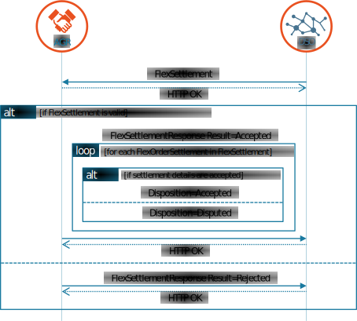

# Settle phase

The informative description of the settle phase processes are provided in [Settle phase](../../general-description/settle-phase.md).
In this chapter, the use cases will be described, as derived from the settle phase.

The USEF MCM settle phase specifies the following use case:

_Use cases for the settle phase._

| Name                         | Direction | Message types                          |
|------------------------------|-----------|----------------------------------------|
| **Process Settlement Items** | AGR ← DSO | FlexSettlement/ FlexSettlementResponse |

## Process Settlement Items

<figure markdown>
  { width=1000px }
  <figcaption>Transmission of settlement including acceptance process per settlement item</figcaption>
</figure>

<table>
  <tr>
    <th></th>
    <th colspan="2">Revoke FlexOrder</th>
  </tr>
  <tr>
    <th>Goal in context</th>
    <td colspan="2">DSO sends consolidated settlement volumes and prices to the AGR for a specific period. AGR verifies the settlement calculations performed by DSO: acknowledge settlement items that are plausible according to the AGR or start a dispute process if they show disputable results. AGR returns the list of verified settlement items.</td>
  </tr>
  <tr>
    <th>Preconditions</th>
    <td colspan="2">All settlement items within the period are available and complete</td>
  </tr>
  <tr>
    <th>Successful outcome</th>
    <td colspan="2">Periodic settlement invoice sent by DSO, validated by AGR and a potential dispute process is started.</td>
  </tr>
  <tr>
    <th rowspan="6">Failure outcome</th>
    <th>RejectionReason</th>
    <th>Cause of rejection</th>
  </tr>
  <tr>
    <td>&lt;See action 3.5&gt;</td>
    <td>FlexSettlement failed to pass validation by the AGR</td>
  </tr>
  <tr>
    <td>Missing Settlement Items</td>
    <td>Not all flexibility that have been procured within the given period is included as a settlement item.</td>
  </tr>
  <tr>
    <td>PeriodStart rejected</td>
    <td>The settlement period starts too late (for example in case there are unsettled items from an earlier period) or is not plausible (for example in case it starts in the future).</td>
  </tr>
  <tr>
    <td>PeriodEnd rejected</td>
    <td>The settlement period ends too early (for example in case there are unsettled items from a later period that have to be treated too) or is not plausible (for example in case it is earlier than the PeriodStart or in the future).</td>
  </tr>
  <tr>
    <td>[User defined]</td>
    <td>Any other reasonable cause to reject the message</td>
  </tr>
</table>

### Related information

If settlement items are missing, the message should be rejected (as mentioned in failure outcome).
This is to encourage sending of all required information necessary to settle trades as soon as possible, thereby avoiding a series of unsettled trades for a given period.

Note that the rejection of a FlexSettlement message is not a means of raising a dispute for settlement items.
The dispute process is out-of-scope for USEF.
